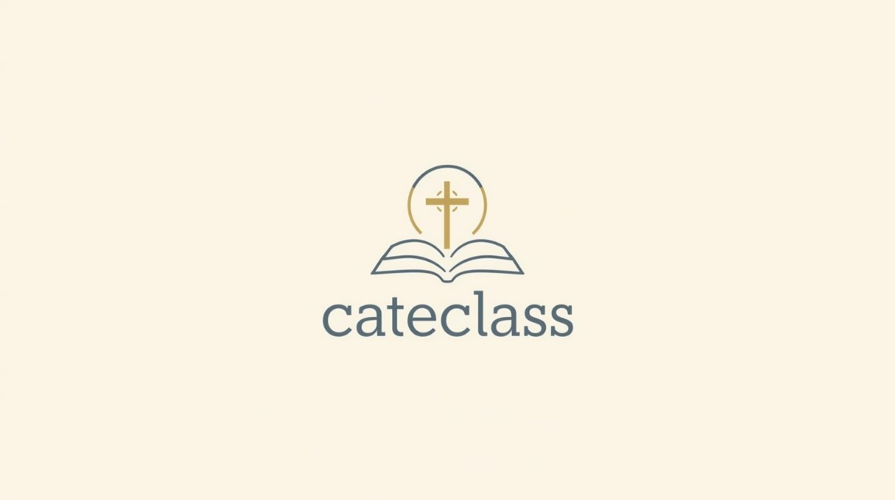

  

✝️ **Cateclass**

Plataforma para gestão de catequese integrada

---

## Centro Paula Souza  
**Faculdade de Tecnologia de Jahu**  
Curso de Tecnologia em Desenvolvimento de Software Multiplataforma  

📍 Jaú - SP, Brasil  
📅 Início: 1º Semestre / 2025  

---

## 📄 Documento de aplicação web

### 📑 Sumário
1. [Resumo da aplicação web](#1-resumo-da-aplicação-web)  
2. [Objetivos](#2-objetivos)  
3. [Funcionalidades](#3-funcionalidades)  
4. [Tecnologias utilizadas](#4-tecnologias-utilizadas)  
5. [Documentos do projeto](#6-documentos-do-projeto)

---

### 1. Resumo da aplicação web  
O **Cateclass** é uma plataforma desenvolvida para facilitar a comunicação e a organização na catequese. Muitas vezes, catequistas, pais e catequizandos enfrentam dificuldades com a troca de informações e o controle das atividades. O sistema busca centralizar essas informações, tornando a comunicação mais rápida, prática e acessível.  .  

---

### 2. Objetivos  
Facilitar a comunicação entre a paróquia, catequistas, pais e catequizandos.

Organizar encontros, eventos e comunicados da catequese.

Oferecer um ambiente acessível via computador ou celular.  .  

---

### 3. Funcionalidades  
✝️ Acompanhamento: Acompanhamento do desempenho dos catequizandos.

📝 Atividades e Lições: controle de atividades e prazos.

📅 Agenda da Catequese: eventos e calendário da catequese.

📢 Comunicados: envio de mensagens importantes pela coordenação.   

---

### 4. Tecnologias utilizadas  
- **Frontend:** HTML, CSS, JavaScript, TailwindCSS  
- **Backend:** Node.js   
- **Banco de Dados:** MySQL 
- **Versionamento:** Git/GitHub  

---
### 5.Local e Escopo
Inicialmente, o Cateclass está sendo desenvolvido para atender às necessidades de gestão da **Paróquia São Benedito**,No futuro há planos para expandir a plataforma, tornando-a acessível e adaptável para outras paróquias e comunidades.

---
### 6. Documentos do projeto  
📂 [Documentação Completa](./documentos)  
📂 [Recursos do Aplicativo](./aplicativo/recursos)  
📄 [Apresentações](./documentos/apresentacao.pdf)  
📄 [Modelagem de Banco de Dados](./documentos/modelagem-bd.pdf)  

---

## 👨‍💻 Equipe de Desenvolvimento  
- jesualdo brandão dias (https://www.linkedin.com/in/jesualdo-brand%C3%A3o-dias-j%C3%BAnior-68a61865/)
- lucas gabriel (https://www.linkedin.com/in/lucas-gabriel-de-paula-pinto-065734241/)
- matheus paschuinio (https://www.linkedin.com/in/matheus-paschuinio-7630aa336/)
- Pedro paulo goncalves ( https://www.linkedin.com/in/pedro-paulo-00114a256/)

---

## 📌 Status do Projeto  
🚧 Em desenvolvimento – 2º semestre de 2025
